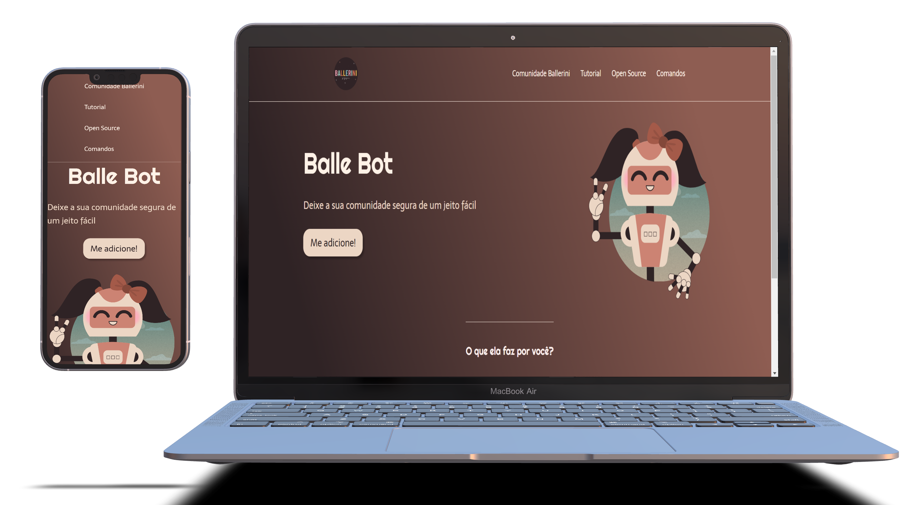

# landing-page-ballerini

<h4 align="center">
    :computer: Landing Page
</h4>

    <a href="#-projeto">Projeto</a>&nbsp;&nbsp;&nbsp;|&nbsp;&nbsp;&nbsp;
    <a href="#rocket-tecnologias">Tecnologias</a>&nbsp;&nbsp;&nbsp;|&nbsp;&nbsp;&nbsp;

 

## 💻 Projeto

Landing Page para prática de flex-box css. Prática youtube: https://www.youtube.com/watch?v=llF6vD-RljE&t=442s

 

## :rocket: Tecnologias

- [ReactJS](https://pt-br.reactjs.org/)
- [Typescript](https://www.typescriptlang.org/)
- [HTML5](https://developer.mozilla.org/pt-BR/docs/Web/Guide/HTML/HTML5)
- [CSS3](https://developer.mozilla.org/pt-BR/docs/Web/CSS)
- [styled-components](https://www.styled-components.com/)
